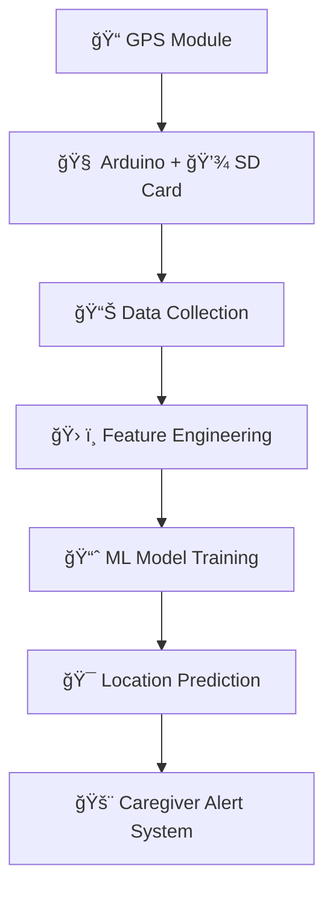

# Architecture Diagram

```mermaid
graph TD
    A[📠GPS Module] --> B[🧠 Arduino + 💾 SD Card]
    B --> C[📊 Data Collection]
    C --> D[ğŸ› ï¸ Feature Engineering]
    D --> E[📈 ML Model Training]
    E --> F[🯠Location Prediction]
    F --> G[🚨 Caregiver Alert System]

```

