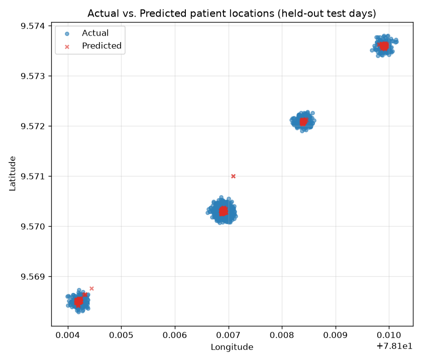

# 🧭 Dementia Patient Location Tracking

<div align="center">

  [](https://github.com/KathirVelan11/GPS-Location-Predictor/actions/workflows/ci.yml)
  [](https://python.org)
  [](https://arduino.cc)
  [](#-results)
  [](LICENSE)
</div>

An end-to-end system that logs a dementia patient's GPS trail with an Arduino and
**predicts their location from date & time** using machine learning — so caregivers
can anticipate a patient's routine and respond faster if they wander.

## 🎯 Problem Statement

Dementia affects millions worldwide, with **~60% of patients experiencing wandering
behavior**. By combining IoT hardware with machine learning, this system learns a
patient's daily location routine and predicts where they are likely to be at a given
time — enabling faster caregiver response.

## 💡 Solution Overview

- 📍 Continuously log patient location (Arduino + GPS + SD card)
- 🔮 Predict coordinates from temporal features (time of day, day of week)
- 🗺️ Visualise actual vs. predicted movement on an interactive map
- 🚨 Give caregivers a head-start when a patient breaks routine

## 📊 Results

Evaluated with a **time-based split** — the model trains on the earliest 80 % of days
and is tested on the *latest, unseen* 20 % (see [Methodology](#-methodology--honest-evaluation)).
The headline metric is **Haversine distance error in metres**, which is what a
caregiver actually cares about.

| Metric (held-out test days)     | Random Forest | Mean-location baseline |
|---------------------------------|:-------------:|:----------------------:|
| **Median error**                | **~11 m**     | ~40 m                  |
| Mean error                      | ~12 m         | ~138 m                 |
| 90th-percentile error           | ~20 m         | ~395 m                 |
| Improvement over baseline (median) | **~73 %**  | —                      |

> Numbers are reproducible from the included sample dataset via `python src/train.py`
> (exact values are written to `models/metrics.json`).

<div align="center">
  
</div>

Red ✕ predictions land inside each real location cluster (home, park, market, temple).
An interactive version is generated at `examples/map.html`.

### 🔮 Example Prediction

```
$ python src/predict.py --datetime "2024-05-20 15:51:00"
Input     : 2024-05-20 15:51:00
Predicted : Latitude 9.570295, Longitude 78.106896
Map       : https://www.google.com/maps?q=9.570295,78.106896
```

## 🔬 Methodology & Honest Evaluation

An earlier version of this project reported an R² of ~0.99999 using a **random**
train/test split. That number is misleading: GPS rows are logged minutes apart, so
consecutive samples are near-duplicates. A random split scatters those near-duplicates
across train and test, letting the model *memorise* the test points — a textbook case
of **data leakage** from temporal autocorrelation.

This version fixes the evaluation:

- **Time-based split** — train on earlier days, test on later days (predict the *future*).
- **Haversine error in metres** instead of R² — an interpretable, leakage-resistant metric.
- **A naive baseline** (always predict the mean location) to prove the model adds value.
- **Bug fix** — the notebook applied `log1p` to sin/cos features, which is undefined for
  values ≤ −1; features are now built without that corruption (covered by a unit test).

The result is a lower but *trustworthy* number: ~11 m median error, ~73 % better than baseline.

> **Note on data:** the real patient GPS log is private and not included. A synthetic
> sample dataset with the same structure (`src/generate_sample_data.py`) makes the whole
> pipeline runnable and reproducible.

## 🧪 Getting Started

```bash
# 1. Clone and install
git clone https://github.com/KathirVelan11/GPS-Location-Predictor.git
cd GPS-Location-Predictor
pip install -r requirements.txt

# 2. Generate the runnable sample dataset
python src/generate_sample_data.py --out data/sample_gps.csv --days 45

# 3. Train (writes model + honest metrics.json)
python src/train.py --data data/sample_gps.csv --out models

# 4. Predict a location from a date & time
python src/predict.py --datetime "2024-05-20 15:51:00"

# 5. Generate the map + scatter plot
python src/visualize.py --data data/sample_gps.csv --model models/model.joblib

# 6. Run the tests
pytest tests/ -q
```

To use **your own** data, produce a CSV matching [docs/DATA_FORMAT.md](docs/DATA_FORMAT.md)
(the Arduino logger already does this) and pass it via `--data`.

## 📂 Project Structure

```
GPS-Location-Predictor/
├── src/
│   ├── generate_sample_data.py  # Synthetic GPS log (runnable stand-in for private data)
│   ├── preprocessing.py         # Raw CSV → engineered temporal features
│   ├── metrics.py               # Haversine distance error metrics
│   ├── train.py                 # Time-based split + Random Forest + baseline
│   ├── predict.py               # CLI: date/time → predicted coordinates
│   └── visualize.py             # Actual-vs-predicted scatter + Folium map
├── tests/
│   └── test_pipeline.py         # pytest unit tests
├── Hardware/
│   └── GPS_data_logging.ino     # Arduino GPS → SD-card CSV logger
├── docs/
│   ├── DATA_FORMAT.md           # Required CSV format & sample data
│   ├── ML_MODELS.md             # Models, tuning, metrics & rationale
│   └── ARCHITECTURE.md          # System architecture diagram
├── examples/
│   └── predictions.png          # Actual vs. predicted plot
├── Location prediction.ipynb    # Original exploratory notebook
├── .github/workflows/ci.yml     # CI: tests + pipeline smoke test
├── requirements.txt
└── README.md
```

## 📟 Arduino GPS Logger

The hardware module collects real-time GPS coordinates and logs them to a `.csv` file on
an SD card, ready for the prediction pipeline.

**Components:** 🛰️ Neo 6M GPS Module · 💡 Arduino Uno · 💾 SD Card + Module · 🔌 Jumper Wires · 🔋 Power Bank

`Hardware/GPS_data_logging.ino` reads GPS data over SoftwareSerial, extracts latitude,
longitude and IST-adjusted date/time, and writes each record to `data.csv`.

> ✅ The generated `.csv` already follows [docs/DATA_FORMAT.md](docs/DATA_FORMAT.md) —
> feed it straight into the Python pipeline.

## 🏗️ Architecture & Models

- **System architecture:** [docs/ARCHITECTURE.md](docs/ARCHITECTURE.md)
- **Model details, tuning & metrics:** [docs/ML_MODELS.md](docs/ML_MODELS.md)

## 🔮 Future Improvements

- Real-time alerts via GSM module or a mobile app
- Edge inference on the microcontroller (no laptop/Colab)
- Sequence models (LSTM) to capture longer movement patterns
- Live map dashboard

## 🤝 Contributing

Fork the repo and send a pull request with any improvements!

## 📄 License

Released under the [MIT License](LICENSE).
